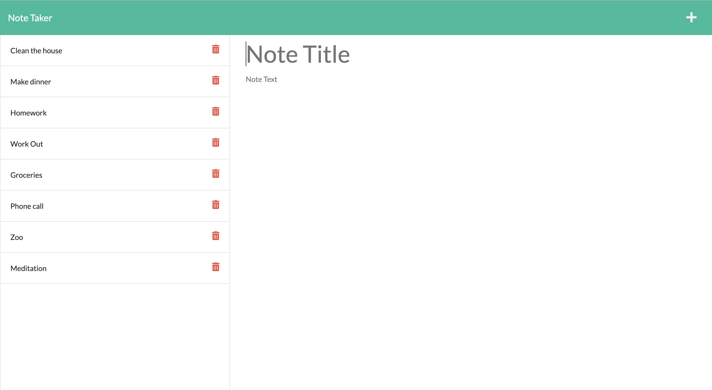
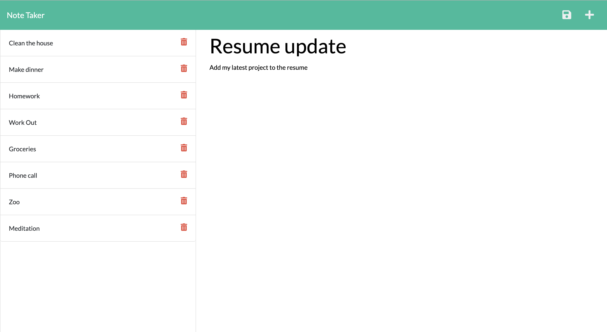

# Forget-Me-Not

https://github.com/AlenaReh/Forget-Me-Not

https://forgetmenot-notetaker.herokuapp.com/notes

## Description 

This application can be used to write and save notes.
  
## Table of Contents

  - [Usage](#Usage)
  - [Demo](#Demo)
  - [Contributions](#Contributions)
  - [Credits](#Credits)
  - [Contacts](#Contacts)
  
## Usage

A simple application to stay on top of your daily tasks. It uses an Express.js back end and can save and retrieve note data from a JSON file.

## Demo 

  * 
  * 

## Contributions
Alena Rehberger

## Credits
Thanks to w3schools https://w3schools.com and Trilogy Education Services for providing all of the necessery tools for building this application.

## Contacts
If you have any questions, feel free to cantact me at: 
  * GitHub: https://github.com/AlenaReh
  * Linkedin: https://www.linkedin.com/in/alena-rehberger/
  * E-mail: alenarehberger92@gmail.com